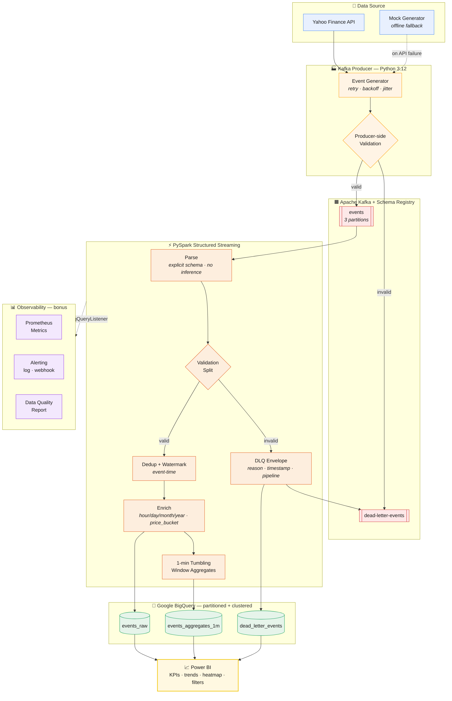

<!-- ========================================================================= -->
<h1 align="center">📈 Real-Time Events Analytics Pipeline</h1>

<p align="center">
  <em>Production-grade, end-to-end streaming pipeline:<br>
  Yahoo Finance → Kafka → PySpark Structured Streaming → BigQuery → Power BI</em>
</p>

<p align="center">
  
  
  
  
  
  
  
</p>

---

## 📌 Overview

This project ingests **real-time stock-market events**, validates and enriches
them with **PySpark Structured Streaming**, routes bad records to a **Dead Letter
Queue**, computes **1-minute tumbling-window aggregates**, and lands everything
in **partitioned/clustered BigQuery tables** for a live **Power BI** dashboard.

It is built to production standards: explicit schemas, watermarking,
checkpointing, idempotent delivery, structured logging, retries & graceful
shutdown, full test coverage, containerization, and an observability stack
(Prometheus metrics, alerting, and data-quality reports).

> **Data source:** Yahoo Finance (live) with a built-in **mock fallback**, so the
> pipeline runs fully offline for demos and CI.

---

## 🏗️ Architecture



Observability runs alongside: a **StreamingQueryListener** exports metrics to
**Prometheus**, an **AlertManager** fires log/webhook alerts on thresholds, and a
**Data-Quality Reporter** scores completeness/validity/uniqueness/timeliness.

---

## 🧰 Tech Stack

| Layer            | Technology |
|------------------|-----------|
| Language         | Python 3.12 |
| Streaming bus    | Apache Kafka + ZooKeeper, Confluent Schema Registry |
| Processing       | PySpark 3.5 Structured Streaming |
| Storage          | Google BigQuery (partitioned + clustered) |
| Cloud / Auth     | GCP service-account authentication |
| Visualization    | Power BI |
| Observability    | Prometheus, structured JSON logging, alerting |
| Containerization | Docker + Docker Compose |
| Testing          | pytest, pytest-cov |
| Quality          | black, isort, flake8, mypy |

---

## 📂 Folder Structure

```
RealTimeEventsPipeline/
├── producer/            # Kafka producer + data source (Yahoo Finance / mock)
│   ├── data_source.py   #   live fetch + mock fallback + fault injection
│   ├── producer.py      #   idempotent producer, retries, graceful shutdown
│   └── run_producer.py  #   CLI entrypoint
├── spark/               # PySpark Structured Streaming
│   ├── transformations.py  # explicit-schema parse + derived columns
│   ├── aggregations.py     # 1-min tumbling windows + dedup
│   ├── bigquery_sink.py    # table lifecycle + foreachBatch writers
│   └── streaming_job.py    # end-to-end orchestration
├── validation/          # data-quality validation (dict + Spark-native)
├── dlq/                 # Dead Letter Queue (Kafka + disk fallback)
├── schemas/             # explicit Spark / JSON / Avro / BQ schemas
├── config/              # typed Pydantic config loader (.env interpolation)
├── utils/               # logging factory + retry/backoff
├── monitoring/          # metrics listener, alerting, DQ report (bonus)
├── tests/               # unit tests (producer, validation, transforms, agg)
├── sql/                 # BigQuery DDL + Power BI helper views
├── docker/              # Dockerfile.producer, Dockerfile.spark
├── powerbi/             # Power BI setup & dashboard design guide
├── logs/                # producer.log / consumer.log / pipeline.log
├── screenshots/         # dashboard screenshots (placeholders)
├── requirements.txt
├── docker-compose.yml
├── config.yaml          # single source of truth for all components
├── .env.example
├── Makefile
└── README.md
```

---

## ✅ Prerequisites

- **Python 3.12**
- **Docker + Docker Compose** (for the local Kafka/Spark stack)
- **Java 11/17** if running Spark locally without Docker
- A **GCP project** with BigQuery enabled and a **service-account key**
  (roles: *BigQuery Data Editor*, *BigQuery Job User*, *Storage Object Admin*)

---

## ⚙️ Installation

```bash
git clone <your-repo-url> RealTimeEventsPipeline
cd RealTimeEventsPipeline

# 1. Python deps
make install            # or: pip install -r requirements.txt

# 2. Configure secrets
make env                # copies .env.example -> .env
#   then edit .env: GCP_PROJECT_ID, BQ_DATASET, BQ_TEMP_BUCKET, etc.

# 3. Add your GCP service-account key
#   download JSON -> config/gcp-key.json   (git-ignored)
```

Adjust non-secret settings (symbols, intervals, windows, thresholds) in
[`config.yaml`](config.yaml).

---

## ▶️ Running Locally (without Docker)

Terminal 1 — start Kafka via Docker (just the bus), then the producer:

```bash
make up                 # zookeeper + kafka + schema-registry + topic creation
make run-producer       # streams events into the `events` topic
```

Terminal 2 — start the Spark streaming job:

```bash
make run-streaming      # spark-submit with Kafka + BigQuery packages
```

Bounded demo / CI run of the producer:

```bash
python -m producer.run_producer --max-ticks 20 --bad-pct 25
```

---

## 🐳 Running with Docker

```bash
# Build + start the entire stack (Kafka, Schema Registry, producer, Spark)
make up-all             # docker compose up -d --build

# Optional Kafka management UI at http://localhost:8080
make ui

# Tail everything
make logs

# Tear down (and wipe volumes/checkpoints)
make down               # or: make clean
```

**Exposed UIs**

| Service            | URL                     |
|--------------------|-------------------------|
| Kafka UI (opt.)    | http://localhost:8080   |
| Schema Registry    | http://localhost:8081   |
| Spark Master UI    | http://localhost:8090   |
| Spark App UI       | http://localhost:4040   |
| Prometheus metrics | http://localhost:8000   |

---

## 🗄️ BigQuery Setup

The Spark job **auto-creates** the dataset and tables on first run
(`CREATE_IF_NEEDED`), partitioned by `event_date` and clustered by
`symbol`/`exchange`. To provision manually instead:

```bash
bq --location=US query --use_legacy_sql=false < sql/create_dataset.sql
bq --location=US query --use_legacy_sql=false < sql/events_table.sql
bq --location=US query --use_legacy_sql=false < sql/aggregates_table.sql
```

Tables created:

| Table | Purpose |
|-------|---------|
| `events_raw` | validated, enriched events (append-only) |
| `events_aggregates_1m` | 1-minute tumbling-window aggregates |
| `dead_letter_events` | records that failed validation |

Helper views (`vw_latest_prices`, `vw_hourly_events`, `vw_dlq_rate`) power the
Power BI visuals.

---

## 📊 Power BI Setup

See [`powerbi/README_PowerBI.md`](powerbi/README_PowerBI.md) for the full guide.
In short: **Get Data → Google BigQuery → `rtep_analytics`**, build the model with
a Date table, add the provided DAX measures, and assemble:

- **KPI cards** — Avg Price, Max Price, Event Count, Total Volume
- **Line chart** — Price over time (by symbol)
- **Bar chart** — Top symbols by volume
- **Pie chart** — Market distribution by exchange
- **Heatmap** — Hourly events (matrix)
- **Slicers** — Date, Company, Exchange

---

## 🧪 Testing

```bash
make test               # full suite with coverage (HTML at logs/htmlcov)
make test-fast          # skips Spark/JVM tests
```

Coverage spans the producer, validation rules, Spark transformations and the
windowed aggregations (requirement #14). Spark tests self-skip when no JVM is
present, so the suite runs anywhere.

---

## 🔍 Code Quality

```bash
make format             # black + isort
make lint               # flake8 + mypy
```

PEP8, type hints, docstrings, modular OO design and production-level comments
throughout.

---

## 🌟 Highlighted Features

- **Exactly-once-ish delivery** — idempotent producer (`acks=all`) +
  checkpointed streaming queries + watermark-bounded dedup.
- **Resilience** — exponential-backoff retries, Kafka reconnect on boot, API
  timeout handling, graceful shutdown on SIGINT/SIGTERM.
- **Dead Letter Queue** — validation failures captured with full context
  (`original_message`, `error_reason`, `processing_timestamp`, `pipeline_name`)
  to Kafka **and** BigQuery, with an on-disk fallback so nothing is lost.
- **Observability (bonus)** — Prometheus metrics, threshold alerting
  (log/webhook), and JSON/HTML data-quality scorecards.
- **Schema discipline** — explicit Spark/JSON/Avro/BQ schemas; Schema Registry
  support; no inference anywhere.

---

## 📸 Screenshots

Add captures to [`screenshots/`](screenshots/) (see its README for the suggested
set) and they’ll render here:

| Overview | Data Quality |
|----------|--------------|
| `screenshots/overview.png` | `screenshots/data_quality.png` |

---

## 🚀 Future Enhancements

- Avro/Protobuf payloads end-to-end via Schema Registry (currently JSON on the
  wire, Avro schema provided).
- Kafka → BigQuery with **Dataflow / BigQuery Subscriptions** as an alternative
  sink path.
- **Great Expectations / dbt tests** layered on the BigQuery tables.
- Autoscaling Spark on **Dataproc** or **Kubernetes** (Spark Operator).
- CI/CD (GitHub Actions): lint + test + image build/push.
- **Iceberg/Delta** bronze-silver-gold layering for replayable history.

---

## 📄 License

Released under the MIT License — free to use for learning and portfolios.

---

<p align="center"><sub>Built as a reference implementation of a modern, production-quality streaming data platform.</sub></p>
